# NutriFlex

## prints

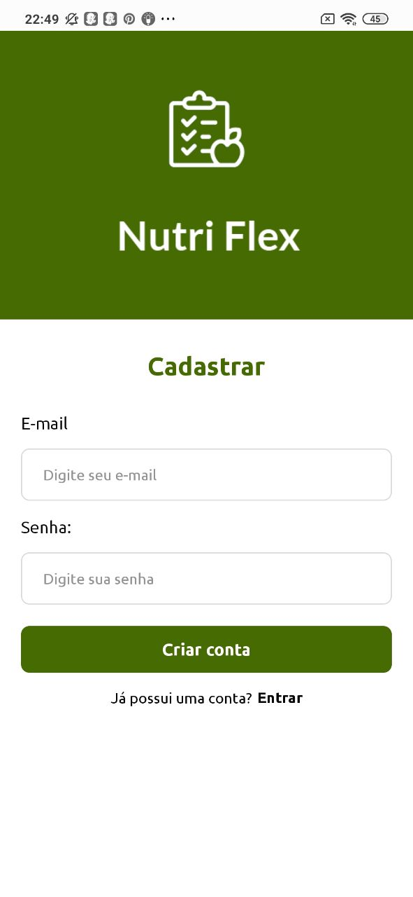 </br>
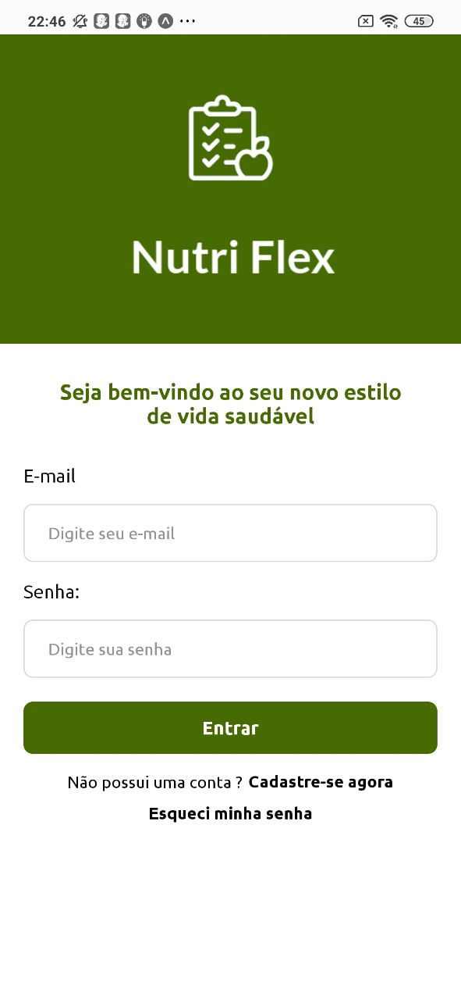 </br>
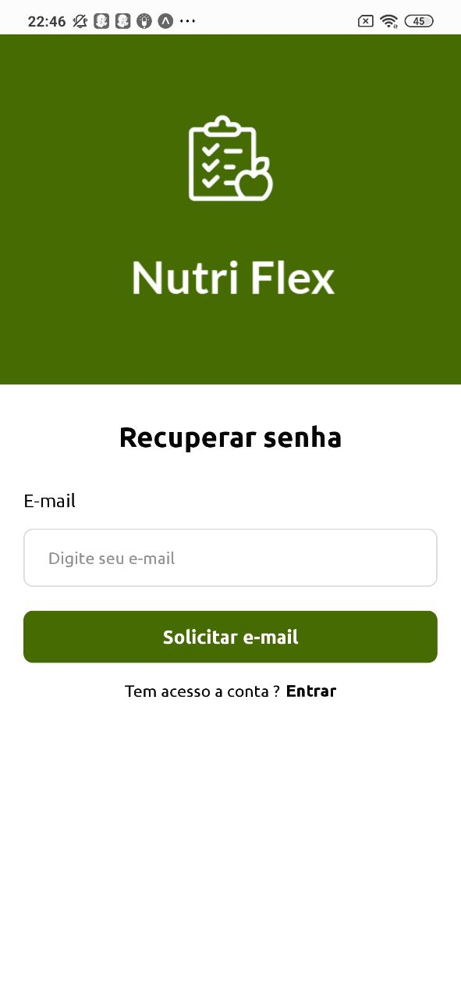 </br>
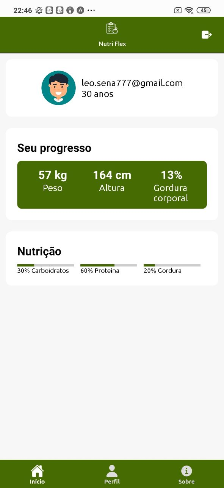 </br>
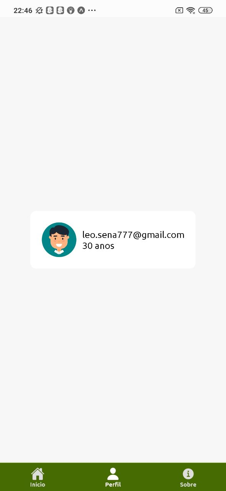 </br>
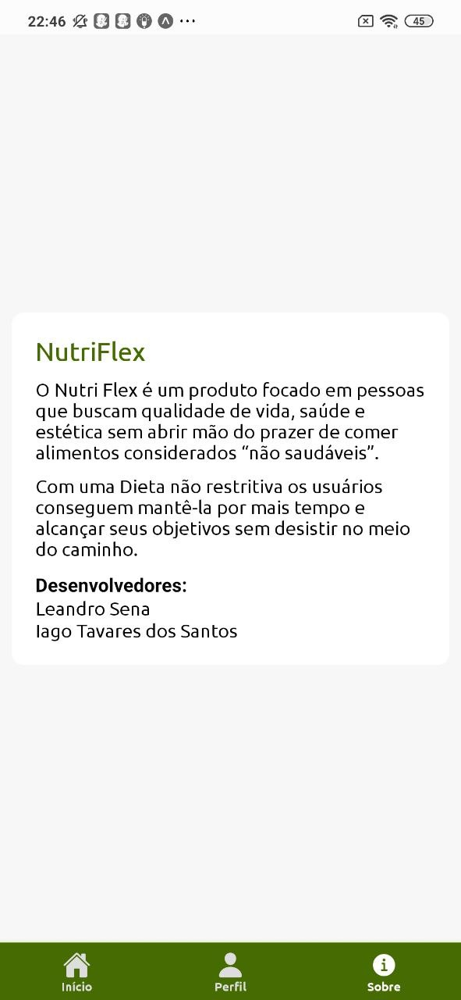 </br>

## Firebase Setup

Altere os dados do firebase no arquivo: `./src/navigation/AppNavigator.js`

```// Better put your these secret keys in .env file
const firebaseConfig = {
	apiKey: '',
	authDomain: '',
	databaseURL: '',
	projectId: '',
	storageBucket: '',
	messagingSenderId: '',
	appId: '',
};
```

## Projeto

Projeto para o curso de analise e desenvolvimento de sistema da fiap

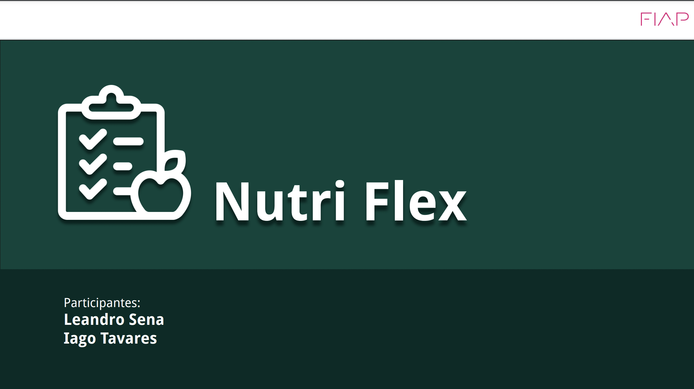 </br>
 </br>
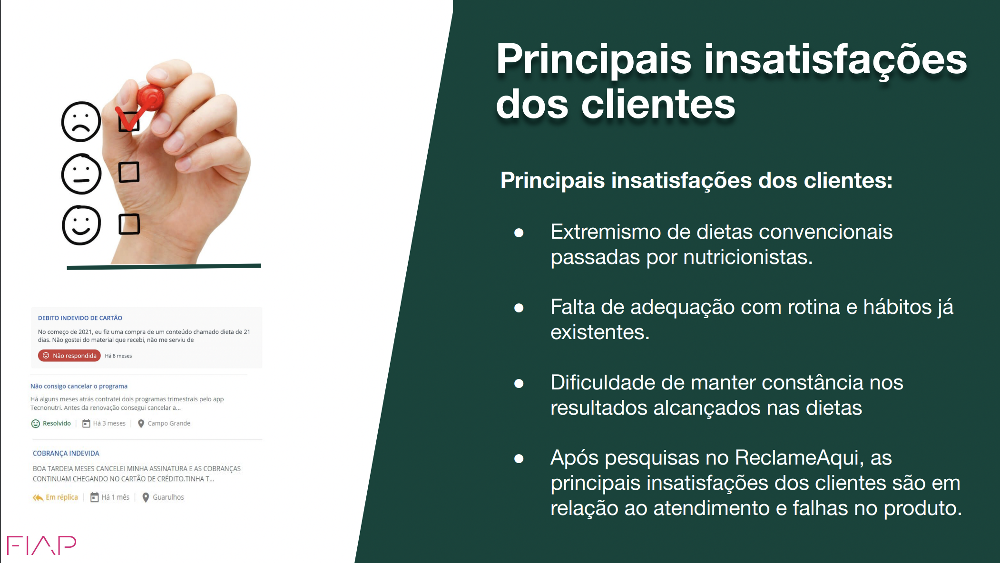 </br>
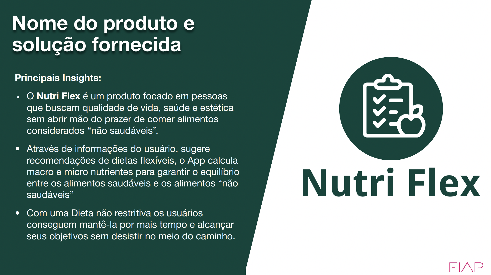 </br>
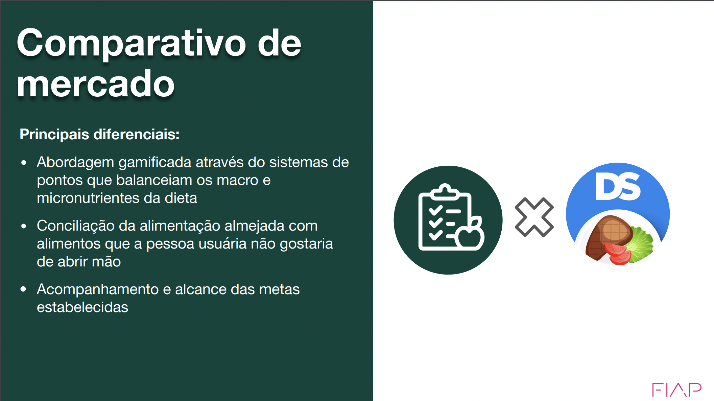 </br>
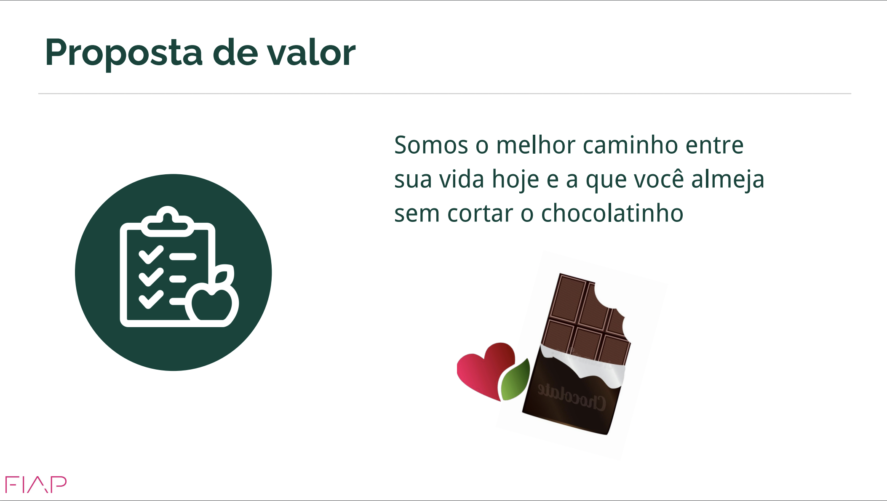 </br>
